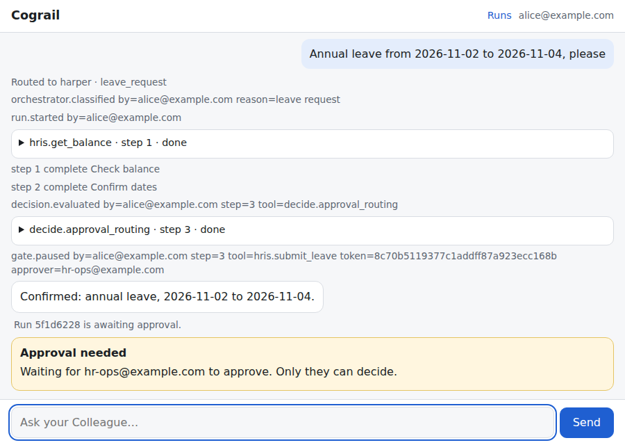
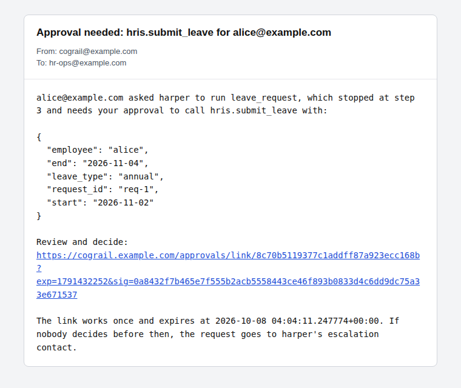
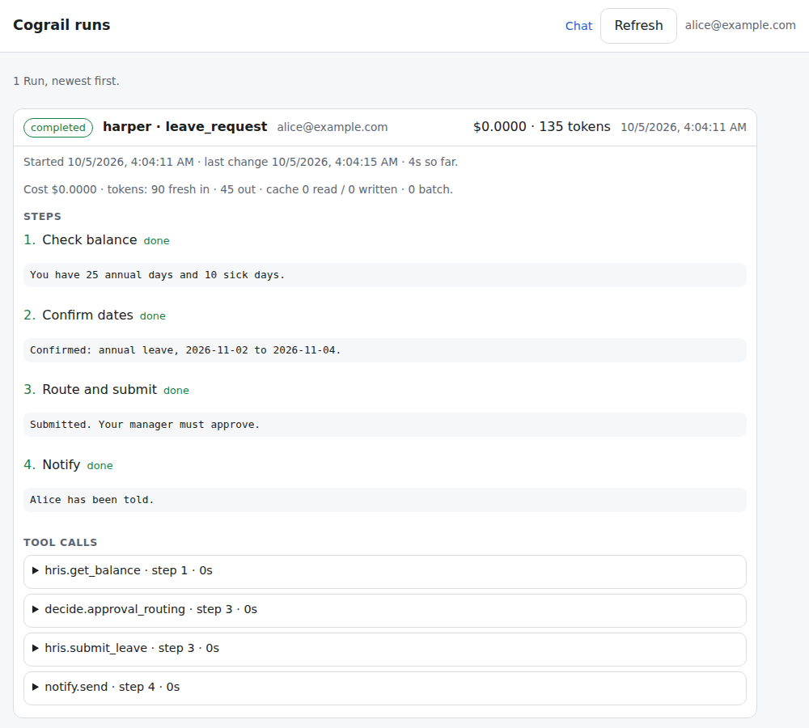
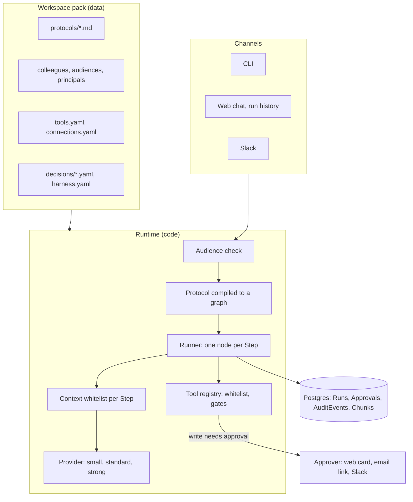
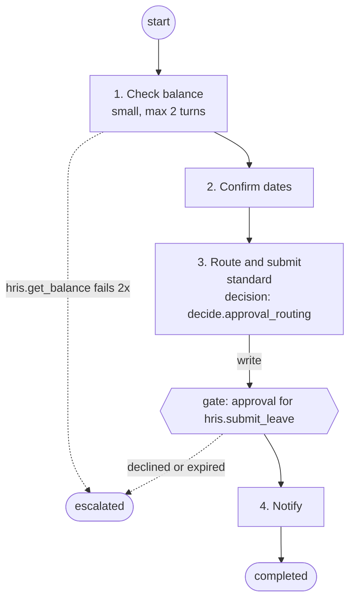

# Cograil

### AI colleagues on process rails

Cograil turns a Markdown runbook into a working AI colleague. Write the procedure the way you would hand it to a new hire; Cograil makes the model follow it step by step, with a tool whitelist on every step, a confirmation gate on every write, audience checks on who may ask, and an audit trail of everything that happened.

A conventional locomotive relies on wheel adhesion and slips on steep grades. A cog engine engages a rack rail and cannot slip or roll back. The model is the engine. The protocol is the rail. The gates are the ratchet.

> Status: pre-release, built in the open during October 2026. See [Roadmap](#roadmap) and `docs/adr/` for the decisions.

## Why

Most agent frameworks ask you to trust the prompt. "Never submit without asking" is a sentence the model may or may not follow. Cograil moves every rule that matters out of the prompt and into data the runtime enforces:

- The model reasons *inside* a Step. It never invents Steps, Tools or Gates.
- A write stops at a Gate until a named person approves. The runner enforces it, not the model.
- Who may ask, what a Step may call and what it may see are checked before anything is spent.
- Every Tool call, Gate, Approval and completion is an AuditEvent with the person it was for.

The people it is for: process owners who know the procedure and can write Markdown, engineers who run it for a team, and reviewers in security and audit who need to see what the AI did and who approved it.

## What a colleague looks like

```markdown
Protocol: Leave Request
Audience: all-employees
Manual execution: allowed

1. Step "Check balance": Use @hris.get_balance for the requester. Tell them the balance.
2. Step "Confirm": Ask the requester to confirm the dates and leave type.
3. Step "Submit": Use @hris.submit_leave with the confirmed dates. (write; requires approval)
4. Step "Notify": Use @notify.send to tell the requester the outcome.

Error handling:
- @hris.get_balance fails: retry once, then escalate to the Human Manager.
```

The runtime parses the steps, restricts each step to the tools it names, pauses before any write for approval, and records every call.

## Quickstart in 90 seconds

You need Python 3.12 and [uv](https://docs.astral.sh/uv/). No database, no API key.

```bash
uv sync
uv run cograil validate workspaces/example-smb
uv run cograil graph workspaces/example-smb --protocol leave_request
uv run cograil decide approval_routing --workspace workspaces/example-smb \
  --input duration_days=12 --input leave_type=annual --input requester_role=staff
```

`validate` reports every problem in a workspace at once. `graph` prints the compiled Protocol as a Mermaid flowchart (below). `decide` evaluates a decision table by hand and prints the rule that fired: the same rule id a Run writes to its audit trail.

To run the protocol end to end (pause at the gate, approve, resume) you need a local Postgres, and either `ANTHROPIC_API_KEY` or a scripted stand-in for the model. [`docs/quickstart.md`](docs/quickstart.md) walks through it with no key. `run` and `approve` are a local and demo tool: `--as` is not authenticated.

`workspaces/example-enterprise` is a second, larger pack: Entra ID sign-in, three colleagues, SharePoint-style knowledge and a Jira tool over REST (see its `README.md`). Both packs carry the same example protocol library: `leave_request`, `it_access_request` and `policy_question` (with citations), each with eval cases in `tests/evals/`.

## What you see

| Web chat | Approval email |
| --- | --- |
|  |  |
| The requester watches each Step and Tool call, then sees who must approve. | The approver gets the exact arguments and a single-use signed link. |

| Run history | Trace |
| --- | --- |
|  |  |
| Every Run of the signed-in person: Steps, Tool calls, Gates, cost and tokens. | Each Step and model call is an OpenTelemetry span, with model and token attributes. |

The first three screenshots come from the real app running the `example-smb` workspace, with a scripted stand-in for the model. The email is its real message body in a mail-client frame.

## Architecture



The same graph, for one Protocol, as `cograil graph` prints it:



The model chooses what to say and which allowed Tool to call inside a node. It cannot add a node, an edge or a Tool. See [`docs/architecture.md`](docs/architecture.md) for the module-by-module tour.

## Design decisions

Each one is an ADR in [`docs/adr/`](docs/adr/README.md).

- **Protocols are Markdown**, versioned by git, readable by the business owner (0001).
- **Gates are tool metadata** enforced by the runner, not instructions the model may ignore (0002).
- **Entitlement is applied before retrieval**, never after: knowledge and directory lookups filter by the principal's groups first.
- **Workspace packs are data; the runtime is code.** One runtime, many clients (0004).
- **Postgres is the only dependency** for small deployments; Temporal is an optional backend for long-running approvals (0003).
- **One Provider interface**, Anthropic by default, model chosen per Protocol and addressed by tier (0005, 0010).
- **Each step declares what it sees,** how many turns it may take and which model tier runs it (0007, 0008).
- **Decisions that matter are tables, not prompts:** the model supplies inputs, the table decides, the audit log records the rule (0009).
- **A Protocol compiles to an explicit graph** that the model never edits (0011).
- **The harness is versioned configuration,** stamped on every Run and eval-gated like protocols (0012).
- **Retrieved text and tool output are data, never instructions.** Injection is screened in layers; see [`docs/threat-model.md`](docs/threat-model.md).

## How the backlog gets built

Work is GitHub issues. An autopilot on the maintainer's Mac starts one task at a time: Claude cloud sessions for lanes 1 and 2, and a GitHub Actions run on GLM for lane 3. Each session follows the same implement-issue command, a pull request merges once its two required checks are green, and a person steps in only for tasks labelled `needs:human`. See `docs/adr/0015-autopilot.md`.

## Limits

Cograil is pre-release. Know these before you rely on it:

- **Not in yet:** no Teams adapter, no multi-tenant mode, no visual editor, no Temporal backend before v0.5.
- **Injection defence is heuristic.** The pattern filter and the screening model lower the risk and do not remove it. What remains is bounded by the Step whitelist and the Gates. See the known limits in [`docs/threat-model.md`](docs/threat-model.md).
- **Knowledge is small-corpus.** The default embedder hashes words, so it rewards shared words, not shared meaning ("holiday" will not find "vacation"). Scanned PDFs without text give no Chunks.
- **Slack replies are visible to the whole channel.** Audiences decide who may start a Run, not who can read the channel; use direct messages for protected Colleagues. See `docs/slack.md`.
- **The CLI does not authenticate.** `--as` is taken at face value; real sign-in belongs to the web and Slack channels. `COGRAIL_AUTH=dev` is for local work only.

## Roadmap

Cograil is built in four phases, ending with the v0.4 launch on November 3, 2026. What the Product Plan lists after that:

- A Temporal `RunStore` backend as the default for enterprise workspaces.
- A Microsoft Teams adapter.
- Colleagues exposed as an MCP server and an A2A endpoint, so other agents can call them.
- A Context Graph: decision traces a Protocol may consult, with decay and review policy.
- A workspace pack registry: install an example pack with one command.

The v0.5 plan is being scoped in the open in issue #43. For the detail, see `docs/Product Plan.md`.

## Learn more

[Quickstart](docs/quickstart.md) · [Concepts](docs/concepts.md) · [Writing a Protocol](docs/runbooks.md) · [Adding a Tool](docs/tools.md) · [Approvals](docs/approvals.md) · [Evals](docs/evals.md) · [Deploying](docs/deploy.md) · [Architecture](docs/architecture.md)

## Licence

Apache-2.0
