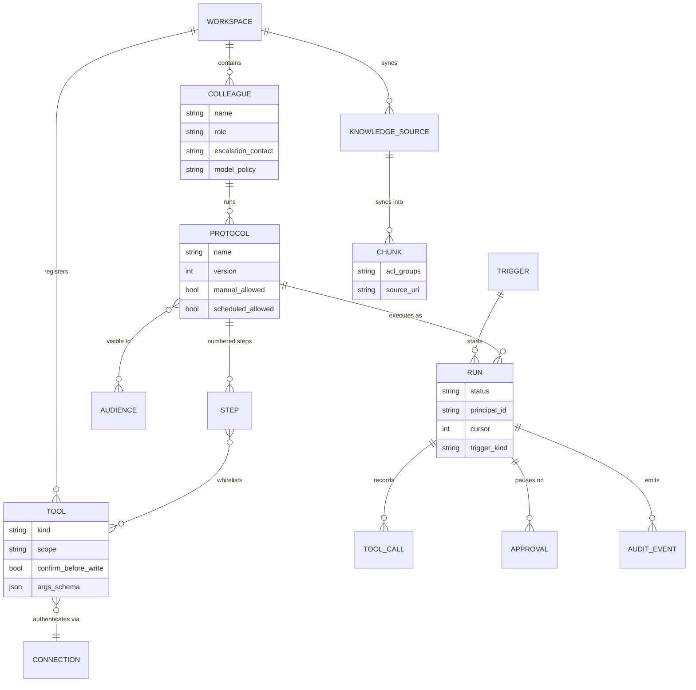
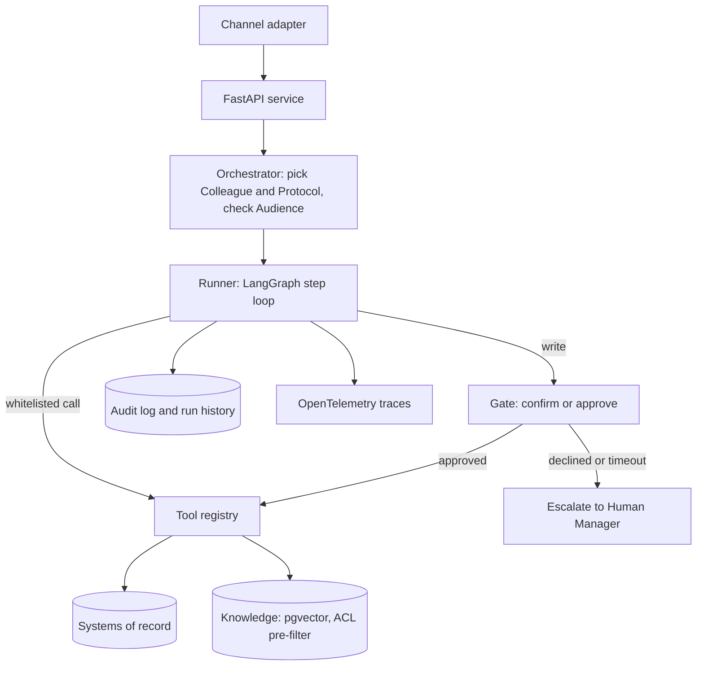
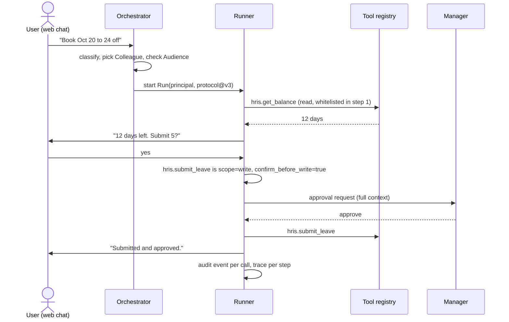
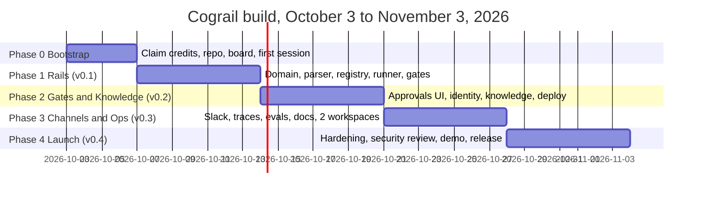
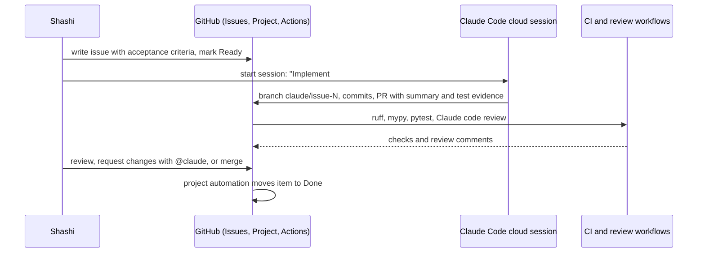

# Cograil Product Plan

### AI colleagues on process rails · Version 1.1 · October 3, 2026 · Owner: Shashi (cognitive-builder)

This is the hand-off document for Claude Code. Read it once in full before the first session, then rely on `CLAUDE.md` for the day-to-day rules. Every phase, milestone and issue below was sized for a four-week build funded by $250 of Claude Code cloud-session credits that expire on November 4, 2026.

---

## 1. Vision

Cograil is an open-source runtime that turns a Markdown runbook into a working AI colleague. You write the standard operating procedure the way you would hand it to a new hire; the runtime makes the model follow it step by step, with a tool whitelist on every step, a confirmation gate on every write, audience checks on who may ask, and an audit trail of everything that happened.

The name is the thesis. A conventional locomotive relies on wheel adhesion and slips on steep grades. A cog engine engages a rack rail (the cograil) and cannot slip or roll back. The model is the engine. The protocol is the rail. The gates are the ratchet.

Positioning in one sentence: Cograil is the deterministic scaffold under the LLM, packaged so one architect can run reliable AI colleagues for several clients of different sizes without rebuilding the plumbing each time.

### Who it is for

| Persona | Situation | What Cograil must do for them |
| --- | --- | --- |
| Independent AI architect (the author) | Three to five clients at a time, each with different systems, team sizes and risk tolerance | Keep client configuration as data in separate private workspace packs; run the same open-source runtime for all of them |
| Small business owner or ops lead (20 to 200 people) | No platform team, Google Workspace or Microsoft 365, a shared inbox and a spreadsheet | One-command deploy, web chat or Slack, two or three colleagues, approvals by email or chat, no identity provider required at first |
| Enterprise pilot team | HRIS, ITSM, SSO, a security review, an audit requirement | SSO via OIDC, audiences from group claims, every write gated, audit export, traces, evals that prove behaviour before promotion |
| Open-source contributor | Wants to add a tool kind, a channel or an example workspace | Clear domain model, ADRs, small modules, tests that run in under a minute |

### Non-goals for v0.x

- Not a helpdesk or ticketing product; it integrates with ServiceNow, Jira or email instead.
- Not a no-code studio; git is the studio and the Markdown file is the source of truth.
- Not multi-tenant SaaS; one deployment per client, workspaces separate configuration, not customers.
- Not a model provider; it routes to Anthropic first and to others through a provider interface.

---

## 2. Product Principles

These are the rules that decide design arguments. They are restated in `CLAUDE.md` because Claude Code reads that file every session.

1. Process rails under the model. The LLM reasons inside a step; it never invents the steps, the tools, or whether a gate exists.
2. Gates are data, not prompts. A tool carries `scope` and `confirm_before_write`; the runner enforces them regardless of what the model says.
3. Pre-filter, never post-filter, entitlement. Knowledge and directory lookups apply the caller's groups before retrieval.
4. Workspace packs are data; the runtime is code. A client's colleagues, protocols, tools and secrets references live in a workspace folder that can sit in a private repo.
5. Model-agnostic by interface, Anthropic by default. One provider interface, one default, swappable per protocol.
6. Everything that happened is in the audit log, with the principal who caused it.
7. Measure before you claim. Deflection, cycle time and cost per resolved run are first-class numbers, each with a baseline.
8. Honest scope. Every feature ships with its limits written down.

---

## 3. Domain Model

Build this first, before frameworks. Names are shared across code, docs, issues and conversation.

```
Colleague ──runs──▶ Protocol ──has──▶ Step ──may call──▶ Tool
    │                   │                                  │
    │ escalates to      │ visible to                        │ authenticates via
    ▼                   ▼                                  ▼
HumanManager        Audience                           Connection
                        
Trigger ──starts──▶ Run ──records──▶ ToolCall / Approval / AuditEvent
                     │
                     │ reads
                     ▼
              KnowledgeSource ──syncs into──▶ Chunk (acl_groups)

Workspace = one client's Colleagues + Protocols + Tools + Connections + KnowledgeSources
```



Vocabulary decisions: Cograil says Protocol where Leena AI says AOP, Colleague where Leena says AIC, Workspace for a client pack, Run for one execution, Gate for any pause point (confirm, approve, escalate). Keep the vocabulary stable; it is part of the product.

---

## 4. Architecture

```
┌──────────────────────────────────────────────────────────────────┐
│  Channels        web chat (static HTML)   Slack   Teams (v0.5)   │
└───────────────┬──────────────────────────────────────────────────┘
                ▼
┌──────────────────────────────────────────────────────────────────┐
│  API (FastAPI)  /chat  /runs  /approvals  /audit  /health         │
│  Orchestrator   intent → Colleague + Protocol, audience check     │
└───────────────┬──────────────────────────────────────────────────┘
                ▼
┌──────────────────────────────────────────────────────────────────┐
│  Runner (LangGraph)  one node per Step, tool whitelist per Step    │
│  Gates               confirm · approve · escalate · threshold      │
│  State               Postgres (v0.1)  →  Temporal (v0.5, optional) │
└───────────────┬──────────────────────────────────────────────────┘
                ▼
┌──────────────────────────────────────────────────────────────────┐
│  Tool registry   python · rest · mcp · knowledge · directory       │
│  Connections     OAuth client credentials, API key, env secrets    │
└───────────────┬──────────────────────────────────────────────────┘
                ▼
┌──────────────────────────────────────────────────────────────────┐
│  Systems         mock HRIS · Google Sheets · Jira · SharePoint …   │
└──────────────────────────────────────────────────────────────────┘
   cross-cutting: identity (OIDC) · audit log · OpenTelemetry · evals
```



### The request path



### Key design decisions (ADRs in docs/adr)

| ADR | Decision | Why |
| --- | --- | --- |
| 0001 | Protocols are Markdown with numbered steps and `@tool` references | Readable by business owners, versioned by git, parsed by a 15-line regex |
| 0002 | Gates are tool metadata enforced by the runner | Removes the model from the safety decision |
| 0003 | Postgres is the only state store in v0.1; Temporal is an optional backend behind a `RunStore` interface from v0.5 | Zero infrastructure for small clients; durable workflows for enterprise without a rewrite |
| 0004 | Workspace packs are data loaded from a folder or a private git repo | One runtime, many clients, no client data in the public repo |
| 0005 | Provider interface with Anthropic default; model chosen per Protocol | Cost per resolved run differs by task; routing is a product feature |
| 0006 | Static HTML web chat, no frontend framework in v0.x | Deploys anywhere, keeps the build fast, matches the author's preference |
| 0007 | Context is declared per step | Context is a whitelist like tools; isolation defeats injection |
| 0008 | Bounded loops with an explicit completion signal | Cost has a ceiling before the first run |
| 0009 | Decisions that matter are tables, not prompts | Auditable, reviewable as diffs, explainable by rule id |
| 0010 | Model tiers, small first | Cost per resolved run and data residency become configuration |
| 0011 | Protocols compile to explicit graphs | The shape of the work is reviewable without code |
| 0012 | The harness is versioned configuration | Runs are reproducible; the harness is the unit of improvement |
| 0013 | Runtime cost discipline | Cheap by default, cost per resolved run as the headline, a cap per client |
| 0014 | Proportionate testing in build sessions | The credit pays for building; GitHub runs the full test suite for free |

---

## 5. Technical Stack

| Layer | Choice | Reason | Cost in v0.x |
| --- | --- | --- | --- |
| Language | Python 3.12, `uv` for packaging | Author's primary language; fast installs in cloud sessions | Free |
| API | FastAPI + Uvicorn | Async, typed, OpenAPI for free | Free |
| Runner | LangGraph | Explicit graph, interrupts for gates, already proven by the author | Free |
| Models | Anthropic SDK behind `Provider` interface; `claude-sonnet-5-5` for steps, `claude-haiku-4-5` for classification; OpenAI and Ollama adapters later | Default quality, cheap routing, swappable | Author's API key, budget $30 for evals and demos |
| State | Postgres 16 with pgvector (Neon free tier for cloud, Docker locally) | One database for runs, audit, approvals, chunks | Free tier |
| Durable workflows | Temporal, optional from v0.5 (Temporal Cloud pay-as-you-go, no minimum, $150 starter credit) | Approvals that wait days; schedules | Free to start |
| Tools | `httpx` REST wrapper (the connector from the interview kit), FastMCP client, plain Python functions | Three kinds cover most clients | Free |
| Identity | OIDC (Microsoft Entra ID or Google) via `authlib`; local dev mode with a fake principal | Group claims become audiences | Free |
| Channels | Static HTML web chat with SSE; Slack Bolt in v0.3; Teams via Bot Framework in v0.5 | Smallest surface first | Free |
| Observability | OpenTelemetry GenAI semantic conventions; console exporter in dev, OTLP to Arize Phoenix when configured | Traces per step, cost per run | Free |
| Evals | `pytest` + JSONL golden set: prompt, expected tool calls, expected gate behaviour | Regression before promotion | API spend only |
| Hosting | Google Cloud Run (scale to zero) + Neon Postgres; Dockerfile also runs on Fly.io or Azure Container Apps | Author's GCP depth, near-zero idle cost | Near zero |
| Docs | MkDocs Material on GitHub Pages | Portfolio-grade docs from Markdown | Free |
| CI | GitHub Actions: ruff, mypy, pytest; CodeQL; Dependabot | Standard, free for public repos | Free |

---

## 6. Phases, Milestones, Dates

Working backwards from November 3: a tagged v0.4 that someone else can deploy and use, with a README that sells the design decisions, a demo workspace, and a short video.



| Phase | Dates | Milestone | Exit criteria | Credit budget |
| --- | --- | --- | --- | --- |
| 0 Bootstrap | Oct 3 to 6 | repo live | Credits claimed before Oct 7; repo, labels, milestones, project board created by `scripts/bootstrap_github.sh`; cloud environment configured; one smoke session opened and merged a trivial PR | $10 |
| 1 Rails | Oct 7 to 13 | v0.1 | `cograil run workspaces/example-smb --protocol leave_request` executes end to end locally with a mock HRIS, pauses at a gate, resumes, writes audit rows; CI green; 80 percent coverage on `domain`, `parser`, `runner`, `gates` | $90 |
| 2 Gates and Knowledge | Oct 14 to 20 | v0.2 | Deployed to Cloud Run with Neon; OIDC login; audiences enforced; approval page and email link; knowledge tool with ACL pre-filter over a SharePoint-style folder; run history page | $70 |
| 3 Channels and Ops | Oct 21 to 27 | v0.3 | Slack adapter; OpenTelemetry traces visible in Phoenix; eval suite of 25 cases with a promotion gate in CI; MkDocs site; second workspace (enterprise flavour) | $50 |
| 4 Launch | Oct 28 to Nov 3 | v0.4 | Security review action clean; README with architecture, decisions and limits; 3-minute demo; GitHub release with changelog; launch post | $30 |

Scope cuts, in order, if credits burn faster than planned: Teams adapter (already deferred), Slack adapter, run history page, second workspace. Never cut tests, audit, or gates.

---

## 7. Backlog

The authoritative backlog is `scripts/backlog.json`, created as GitHub issues by `scripts/create_backlog.py`. Each phase has an Epic issue whose task list links its children. Summary:

### Phase 1 Rails (15 issues)

1. Domain model in `src/cograil/domain.py` with Pydantic v2 and tests.
2. Protocol parser: Markdown to `Protocol` with steps, `@tool` references, helpers, error handling and guardrails sections.
3. Workspace loader: read `colleagues/*.yaml`, `protocols/*.md`, `tools.yaml`, `connections.yaml` from a folder.
4. Tool registry with `python`, `rest` and `mcp` kinds; JSON schema validation of arguments.
5. Mock HRIS tool pack (balances, submit leave, get manager) for the example workspace.
6. Runner: LangGraph graph with one node per step, whitelist enforcement, step cursor, context accumulation.
7. Gates: `confirm_before_write`, `approve` (pause run, persist state, resume by token), `escalate`, failure thresholds.
8. Postgres `RunStore`: runs, tool calls, approvals, audit events; Alembic migrations.
9. CLI `cograil run`, `cograil validate`, `cograil approve`.
10. Anthropic provider with tool-use, plus a `FakeProvider` for tests.
11. CI workflow: ruff, mypy, pytest with Postgres service container.
12. Developer docs: `docs/architecture.md` and the first four ADRs.

### Phase 2 Gates and Knowledge (13 issues)

13. FastAPI service: `/chat` (SSE), `/runs`, `/approvals/{token}`, `/audit`, `/health`.
14. Static HTML web chat with streaming and approval cards.
15. OIDC login (Entra ID and Google) with a local dev principal.
16. Audiences from group claims; audience check in the orchestrator.
17. Orchestrator: classify intent, pick Colleague and Protocol, refusal path.
18. Knowledge source loader (folder of Markdown or PDF) with chunking and `acl_groups` tags.
19. Knowledge tool: pgvector search with ACL pre-filter and citation output.
20. Approval by email link (SMTP or Resend) and in-chat card.
21. Dockerfile, Cloud Run deploy workflow, Neon connection, secrets via environment.
22. Run history page (read-only) showing steps, calls, gates and cost.

### Phase 3 Channels and Ops (11 issues)

23. Slack adapter (Bolt): messages, approval buttons, threads per run.
24. OpenTelemetry: span per run and per step with GenAI attributes; OTLP exporter config.
25. Cost telemetry: tokens and dollars per run, per protocol, surfaced in `/runs`.
26. Eval harness: JSONL golden set, expected tool calls and gate behaviour, `cograil eval`.
27. Promotion gate in CI: evals must pass before a protocol version is marked `released`.
28. Scheduled triggers (cron) running as a system actor with a named audience.
29. MkDocs Material site on GitHub Pages: quickstart, concepts, writing a protocol, adding a tool.
30. Second workspace `workspaces/example-enterprise`: SSO, two colleagues, SharePoint-style knowledge, Jira tool.
31. Example protocol library: leave request, IT access request, policy question with citations.

### Phase 4 Launch (9 issues)

32. Security review: run `claude-code-security-review`, fix findings, document threat model.
33. Hardening: rate limits, input size caps, prompt-injection defences on knowledge content, secret scanning.
34. README rewrite: vision, 90-second quickstart, architecture, decisions, limits, roadmap.
35. Demo script and 3-minute recording using the SMB workspace.
36. Release v0.4: changelog, version bump, GitHub release, PyPI publish (`cograil`).
37. Launch post for LinkedIn and a Show HN draft.
38. Contributor guide, code of conduct, issue labels for `good-first-issue`.
39. Post-launch roadmap issue (v0.5 and beyond) with Temporal backend, Teams, MCP server exposure, Context Graph.
48. Spike: distillation plan from traces to a dedicated small classifier.

### Added in v1.1 for the six disciplines

40. Phase 1: bounded step loop and `harness.yaml` (ADR 0008, 0012).
41. Phase 1: ContextBuilder with per-step context declaration and data isolation (ADR 0007).
42. Phase 1: `cograil graph` renders the compiled protocol as Mermaid (ADR 0011).
43. Phase 2: decision tables and the `decision` tool kind (ADR 0009).
44. Phase 2: model tiers and an Ollama provider for local small models (ADR 0010).
45. Phase 2: compression of long tool outputs with the small tier (ADR 0007).
46. Phase 3: promotion gate covers `harness.yaml` and decision tables (ADR 0012).
47. Phase 3: injection defence for retrieved content and tool outputs (ADR 0007).

---

## 8. The Self-Driving Codebase Operating Model

The repository is the control plane. GitHub holds intent (issues), Claude Code cloud sessions hold execution, Actions hold verification, and the human holds merge.



### The loop, step by step

1. Every unit of work is an issue created from the Task form: goal, context, acceptance criteria as checkboxes, files likely touched, size, suggested model.
2. The project board `Cograil Roadmap` has fields Status, Phase, Size, Model and Credit estimate. Built-in automations add new issues and move closed ones to Done.
3. A session starts from a Ready issue with the standard prompt in `.claude/commands/implement-issue.md`. Sessions run on Anthropic's cloud, consume the promotional credit, and open a PR on a `claude/` branch.
4. `ci.yml` runs lint, types and tests. `claude-code-review.yml` reviews every PR against `CLAUDE.md`. Both are required checks on `main`.
5. The human reviews and merges. Follow-ups discovered in review become new issues, never scope creep in the PR.
6. Once a week, a short retrospective issue records credit spend, what the sessions got wrong, and the `CLAUDE.md` edits that fix it. `CLAUDE.md` is the product of the retrospectives.

### GitHub features in use

| Feature | Use |
| --- | --- |
| Issues with forms | Task, Bug, Spike templates with required acceptance criteria |
| Epics via task lists | One Epic issue per phase; GitHub tracks sub-issues from the task list |
| Milestones | v0.1 to v0.4 with due dates |
| Projects | Board, table by phase, roadmap view; custom fields for Size, Model, Credit estimate |
| Rulesets | Require PR, require CI and review checks, no force-push to `main` |
| Actions | CI, Claude review, security review, deploy on tag, docs publish |
| Dependabot and CodeQL | Weekly dependency PRs; code scanning on public repo |
| Releases | Tagged releases with generated notes |
| Discussions | Enabled at v0.4 for community questions |
| Pages | MkDocs site from `docs/` |

### Where the credits go, and where they do not

- Cloud sessions started from claude.ai/code, the desktop or mobile app, or `claude --cloud` draw down the $250 promotional balance. These do the implementation work.
- The `@claude` workflows (`claude.yml`, `claude-code-review.yml`) run on GitHub Actions and authenticate with either an Anthropic API key or a Claude subscription OAuth token; they are not covered by the promotional credit. Use the OAuth token so reviews count against the Max plan quota rather than API spend, and keep review prompts short.
- Routines and Projects on claude.ai/code are excluded from the promotional credit per the offer terms, so scheduled automation waits until after November 4.
- Measure after the first three sessions: note the balance, compute cost per issue by size, and rebalance the per-phase budget. The plan assumes a medium issue costs single-digit dollars and a large one costs low double digits; treat that as a hypothesis until measured.

### Lanes, Helpers and Test Budget (Change 03)

Every task carries a lane. Lane 1 (12 tasks: runner, gates, registry, access filtering, evals, security) runs on Opus 5.5 with Ultracode. Lane 2 (25 tasks) runs on Sonnet 5.5 at high effort, the repo default. Lane 3 (11 tasks: docs and small chores) runs through `@claude` on GitHub with GLM, using none of the credit. Inside sessions, role helpers in `.claude/agents/` do the cheap work: scout and checker on Haiku, reviewer and writer on Sonnet, architect on Opus for rare design questions. Testing follows the Testing Budget in `CLAUDE.md`, enforced by `.claude/hooks/test_budget.py` (ADR 0014). Lane labels come from the issue forms automatically (`.github/workflows/lane-label.yml`).

Credit targets, to be replaced by measured numbers after the first three sessions: Lane 1 about $11 per task, Lane 2 about $3.75, Lane 3 $0, with $25 held in reserve. Every session's cost goes in the pinned Credit Ledger issue.

### Session hygiene

- One issue per session. If the session discovers a second problem, it opens an issue and stops.
- Sessions never touch `main` directly and never edit `CLAUDE.md` or ADRs without an issue that asks for it.
- Secrets never enter the repo; cloud environments and Actions use their own secret stores.
- Every PR includes test evidence in the description (command and summary of output).

---

## 9. Budget

| Item | Amount | Notes |
| --- | --- | --- |
| Claude Code cloud sessions | $250 promotional credit | Claim by Oct 7, spend by Nov 4; phases budgeted above |
| Review and `@claude` workflows | GLM Coding Plan (Z.AI) | Routed via `ANTHROPIC_BASE_URL`; switch to `CLAUDE_CODE_OAUTH_TOKEN` for Claude parity if review quality disappoints |
| Runtime API spend (evals, demo) | $30 cap | Author's Anthropic API key; `claude-haiku-4-5` for classification keeps it low |
| Neon Postgres | Free tier | Upgrade only if the demo needs more storage |
| Cloud Run | Free tier, scale to zero | A few dollars at most for demo traffic |
| Temporal Cloud | $0 until v0.5 | $150 starter credit when enabled |
| Domain, docs, CI | $0 | GitHub Pages and Actions on a public repo |

---

## 10. Quality

- Tests: unit tests for domain, parser, registry, gates; integration tests with a Postgres service container; one end-to-end test that runs the example protocol with the `FakeProvider`.
- Evals: 25 golden cases by v0.3, each asserting the tool calls made, the gates hit and the final status, not the prose.
- Static checks: ruff (format and lint), mypy strict on `src/`, Bandit optional.
- Security: no secrets in repo, least-privilege Actions permissions, CodeQL, the Claude security review action before v0.4, prompt-injection defence on knowledge content (treat retrieved text as data, never as instructions).
- Performance target for v0.4: first token under 2 seconds on Cloud Run warm, run cost visible per request.

---

## 11. Risks

| Risk | Likelihood | Impact | Mitigation |
| --- | --- | --- | --- |
| Credits not claimed by Oct 7 | Low | High | Phase 0 step 1, today |
| Credits burn faster than planned | Medium | Medium | Measure after three sessions; scope cuts listed in section 6 |
| Sessions drift from the design | Medium | Medium | `CLAUDE.md` rules, ADRs, one issue per session, review workflow |
| LangGraph interrupt semantics complicate pause and resume | Medium | Medium | `RunStore` persists state explicitly; the graph is rebuilt on resume |
| OIDC setup eats a week | Medium | Medium | Dev principal first; OIDC behind a feature flag; Google before Entra |
| pgvector on Neon free tier is slow for large corpora | Low | Low | Corpora in v0.x are small; document the limit |
| Name or package collision | Low | Low | `cograil` verified clean on the web; check PyPI during Phase 0 |

---

## 12. Launch

- README that reads like a design doc: why rails, why gates are data, why workspaces are data, what it does not do.
- Demo: the SMB workspace, a leave request in web chat, the approval email, the audit page, the trace in Phoenix. Three minutes.
- Posts: LinkedIn article on the cog railway thesis; Show HN draft; a short thread on the self-driving build with the credit burn-down chart.
- Portfolio framing: product vision, design decisions, delivery process, measurable outcomes, honest limits.

---

## 13. After the Credits (v0.5 and beyond)

- Temporal `RunStore` backend as the default for enterprise workspaces.
- Microsoft Teams adapter; voice later if ever.
- Expose colleagues as an MCP server and an A2A endpoint so Copilot Studio or other agents can call them.
- Context Graph: decision traces that a protocol may consult, with decay and review policy.
- Workspace pack registry: install an example pack with one command.
- Hosted option for people who do not want to deploy, only if the open-source core is healthy first.

---

## 14. Day-One Checklist for Shashi

- [ ] Claim the cloud-session credit at claude.ai (deadline October 7, 2026) and confirm the balance shows $250.
- [ ] Create the empty public repository `cognitive-builder/cograil` on GitHub (Apache-2.0 licence, no README yet).
- [ ] Copy this kit into the repo, commit, push.
- [ ] Run `scripts/bootstrap_github.sh` (needs `gh auth login` with `repo` and `project` scopes) to create labels, milestones, the project and the backlog issues.
- [ ] In claude.ai/code, connect GitHub, select the repo, and paste `scripts/cloud_setup.sh` into the environment's setup script.
- [ ] Add the repository secret `ZAI_API_KEY` for the review and `@claude` workflows (GLM via Z.AI); or delete the env blocks in the two workflows and use `CLAUDE_CODE_OAUTH_TOKEN` / `ANTHROPIC_API_KEY` instead.
- [ ] Open the first cloud session with `/implement-issue 1` and watch it open a PR.
- [ ] After three merged PRs, record the credit balance in the Phase 0 retrospective issue and adjust the budget table.

---

## 15. Engineering Disciplines (added in v1.1)

Cograil is a harness. Six disciplines describe its six faces; each has an ADR and issues.

| Discipline | Where it lives | Mechanism | ADR | Issues |
| --- | --- | --- | --- | --- |
| Context Engineering | Per-step context | `(context: steps 1, 2)` selection, whitelisted tool schemas only, isolated data block, small-tier compression, Window Ledger per run | 0007 | 41, 45, 47 |
| Loop Engineering | Inside a step | `max_turns`, token and dollar budgets, structured `step_complete`, `LoopBudgetExceeded` escalates | 0008 | 40 |
| Harness Engineering | The whole runtime | `harness.yaml` versioned and stamped on every Run; promotion gate on harness and protocol changes | 0012 | 40, 46 |
| Graph Engineering | The runner | Protocol compiles to an explicit graph; helpers as subgraphs; `cograil graph` Mermaid render; Graph RAG and Context Graph after credits | 0011 | 42 |
| Decision Models | A tool kind | DMN-style YAML tables, first-match or collect, rule id in the audit event | 0009 | 43 |
| Small Language Models | Model-tier policy | small, standard, strong tiers; Ollama or NIM provider for local models; small by default for classification, extraction, redaction, compression; distillation spike | 0010 | 44, 48 |

Sequencing rule: Phase 1 ships the loop, context and graph foundations because the runner cannot be correct without them; Phase 2 adds decisions and tiers because they change cost and reviewability; Phase 3 locks them behind the promotion gate. If credits run short, cut 45 and 44's Ollama provider before anything in Phase 1.

### First session

Issue 1 (domain model) with issue 11 (CI) in a parallel session. The runner (issue 6) depends on domain, parser, registry and provider; starting there forces a session to invent all four. Order: day 1 issues 1 and 11; day 2 issues 2 and 10; day 3 issues 4 and 8; day 4 issue 6 then 7 (Opus); day 5 issues 40 and 41, then 5, 9, 42, 12.

## 16. References

- Claude Code on the web and cloud sessions: https://code.claude.com/docs/en/claude-code-on-the-web
- Claude Code web quickstart: https://code.claude.com/docs/en/web-quickstart
- Routines (scheduled and GitHub-triggered runs): https://code.claude.com/docs/en/web-scheduled-tasks
- Claude Code GitHub Action: https://github.com/anthropics/claude-code-action
- Promotional cloud-session credit terms (secondary coverage): https://www.ghacks.net/2026/09/26/anthropic-offers-up-to-250-in-free-claude-code-cloud-credits-to-pro-and-max-subscribers/
- Temporal Cloud pay-as-you-go announcement: https://temporal.io/blog/paygo-developer-support
