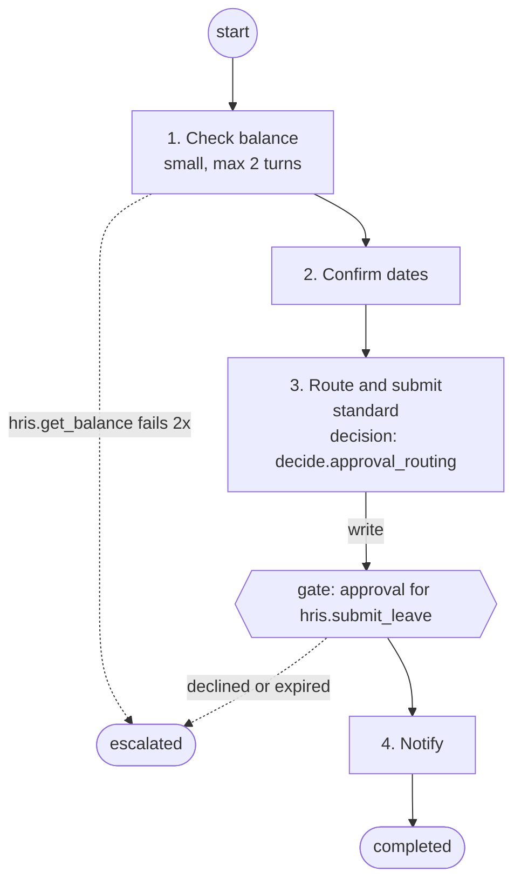

# Architecture

Cograil turns a Markdown runbook into an AI colleague that follows it step by step. The model
reasons inside a `Step`; the rails — steps, tool whitelists, gates, budgets, the audit trail —
are data and code around it. This page describes the code as it stands; each layer names the
module that implements it.

## Layers

```
+---------------------------------------------------------------------------+
| Workspace pack (data)                                          ADR 0004    |
| colleagues/*.yaml  protocols/*.md  tools.yaml  connections.yaml           |
| audiences.yaml  principals.yaml  knowledge.yaml  harness.yaml  tools/*.py |
+---------------------------------------------------------------------------+
      |  workspace.py load_workspace · parser.py parse_protocol
      |  validate.py validate_workspace · audience.py check_audience
+---------------------------------------------------------------------------+
| Entry point                                                               |
| cli.py: cograil run | approve | runs | validate | graph                   |
+---------------------------------------------------------------------------+
      |
+---------------------------------------------------------------------------+
| Runner                                                       ADR 0011      |
| runner.py Runner: runs the Steps, checks every call, invokes the Tools    |
| graph.py compile_protocol: a LangGraph graph, one node per Step           |
| graph.py compile_graph: the same shape as data, rendered as Mermaid       |
|                                                                           |
|   context.py   what a Step sees; the Window Ledger           ADR 0007     |
|   tool_results.py  Tool results to the model, failure thresholds          |
|   compression.py long Tool results, small tier               ADR 0007     |
|   harness.py   version, loop bounds, cost                 ADR 0008, 0012  |
|   gates.py     Approvals, escalation                        ADR 0002     |
|   providers/   one Provider interface; Anthropic default    ADR 0005     |
|   registry.py  Tool kinds: python, rest, mcp (tool_kinds/)                |
+---------------------------------------------------------------------------+
      |
+---------------------------------------------------------------------------+
| State                                                        ADR 0003      |
| store.py RunStore -> PostgresRunStore (default), InMemoryRunStore (tests) |
| runs, tool_calls, approvals, audit_events (append-only)                   |
+---------------------------------------------------------------------------+
```

The workspace pack is data the runtime loads, never code the runtime forks per client. The
runner owns every check: the Provider answers "what does the model want to do next", the
registry answers "what is this Tool and what did it do", and neither decides whether a call
may happen. State lives in one place, behind the `RunStore` interface.

## Request path

A Run arrives on the CLI. The web and Slack channels (issues #18, #27; see `docs/slack.md`) enter
at the same place the CLI does: a loaded workspace, a provider, a store, a `Runner`.

1. `cograil run workspaces/example-smb --protocol leave_request --as alice@example.com
   --message "Annual leave from 2026-11-02 to 2026-11-04, please"`. The message is required.
2. `load_workspace` reads the pack. Every failure is a `WorkspaceError` naming the file;
   `validate_workspace` reports every problem at once rather than the first.
3. The Protocol is picked by name, then the Colleague whose `protocols` list names it.
4. The principal comes from `principals.yaml`. An unknown `--as` still runs, with no groups:
   the CLI is a local and demo tool and does not authenticate anyone. See `docs/auth.md` for
   how the web service signs people in.
5. `check_audience` runs before the Run exists. An `AudienceDenied` exits 1: entitlement is
   checked before anything is spent.
6. The Provider is `FakeProvider` with the plans from `--fake-script`, or
   the provider the harness names (`make_provider`): Anthropic, which needs
   `ANTHROPIC_API_KEY`, or Ollama.
7. `open_store` opens the `PostgresRunStore` named by `DATABASE_URL`, wrapped in a
   `ProgressStore` that echoes every AuditEvent and every finished Step as a line of progress.
8. `build_registry` builds the `python`, `rest` and `mcp` kinds. A Step that names a Tool
   nothing implements refuses to start: the Run never begins with a whitelist it cannot honour.
9. The Run is created — `Trigger` kind `chat`, channel `cli` — with its input,
   `Run.context["input"] = {"message": <text>, "requester": <principal id>}`
   (`cograil.run_input`), and saved. The web chat creates its Run the same way, with the
   chat message. The message is the user's own data: it stays on the Run (a resumed Run needs
   it) and never goes into an AuditEvent or a log line.
10. `Runner.run` stamps the harness and tool pack versions on the Run, writes `run.started`,
    and `compile_protocol` (`graph.py`) builds the graph: one node per Step, edges in step
    order, entry at the Step after `Run.cursor`.
11. Inside a Step, until `step_complete` or a bound:
    - `ContextBuilder.opening` builds what the model sees: the Run's input (on every Step),
      the prior Steps the Step declares (else the harness default), the schemas of its
      whitelisted Tools only, and the data preamble in front of the input and prior outputs.
      Only the requester's id goes in, never their groups. Its tokens are counted in the
      Window Ledger, kept in `Run.context["ledger"]`, with the input as its own source,
      `input`.
    - `check_bounds` runs before every provider call: the Step's turns, its token budget, the
      Run's cost budget. A breach escalates the Run.
    - `Provider.plan` returns text and planned tool calls, with token usage.
    - Every call of the plan is checked before any of them runs. A Tool the Step does not
      whitelist raises `ToolNotAllowed` and nothing runs.
    - A write Tool with `confirm_before_write` needs an approved Approval for the same Run,
      step, Tool and arguments. Without one the Run does not fail — `Gates.pause` saves the
      Step's progress in `Run.context["paused"]`, creates a pending Approval, and the Run goes
      `awaiting_approval`. The CLI prints the `cograil approve` command and exits 3.
    - `ToolRegistry.invoke` validates the arguments against the Tool's `args_schema`, calls it,
      and records a `ToolCall` and a `tool.called` AuditEvent — plus `tool.started` just before
      a write, so a crash mid-write still leaves a record.
    - Results go back to the model as data, inside the data block. A failed call counts
      against the Tool's threshold from the Protocol's `Error handling:` section and escalates
      the Run at the limit; a Tool with no threshold fails the Run closed.
    - The structured `step_complete` signal ends the Step. Its output and tool calls are saved
      to `Run.context["steps"]`, and `Run.cursor` moves to the Step's number.
12. The last Step done, the Run completes and `run.completed` is written. Any error fails the
    Run closed: status `failed`, a `run.failed` AuditEvent, the cursor left at the last
    completed Step.

A paused Run continues with `cograil approve <token> --as <approver>`, which calls
`Runner.resume`. Only the Approval's approver may decide it, never the Run's own principal;
anyone else is refused and the attempt is audited. Two racing resumes cannot both succeed:
the Approval is decided once, and the decision, the Run and the decision's `gate.resumed` or
`run.escalated` AuditEvent are saved in the same transaction, so a crash cannot leave a
decided Approval without its AuditEvent.

The tool pack version is a sha256 of the workspace's validated Tools and of the source of every
workspace python module they resolve to (`build_registry`); the resolver runs the bytes it
hashed. `Runner.run` stamps it on the Run next to the harness version (`run_versions.py`). An
approval of a Run whose tool pack or `harness.yaml` has changed since it started is refused with
`ToolPackChanged` or `HarnessChanged`, after the approver check and with a `gate.refused`
AuditEvent naming the decider (reason `run_version_changed`), so an approved write never runs
other code, bounds, tiers or prices than the Run started with; the Run has to be restarted. It
stays paused, its Approval can still expire, and the approver can still decline it, which
escalates as usual: a decline runs no Tool code. `Runner.run` keeps both versions too: a Run
left `running` that was stamped with others is refused, not re-stamped.

`Runner.run` and `Runner.resume` each claim the Run for their execution: `RunStore.claim_run`
compares the claim and status the caller read and sets a fresh claim, and every later save of
the Run is conditional on that claim. Of two executions started from the same read, exactly
one goes on and the other raises `RunClaimLost`. A Run left `running` by a killed process can
still be run again; its new claim takes the Run over, and an execution whose claim was taken
over stops at its next save without failing the Run. The claim fences Run saves and
Approvals: until that next save, the execution that was taken over may still make provider
calls and ungated tool calls, as a process killed mid-Step would have, but it can neither
spend an Approval nor create one. `RunStore.spend_approval` spends only while the stored
claim is still the caller's, and no claim can take the Run over until the spend commits;
`Gates.pause` saves the paused Run and its pending Approval together in one fenced
transaction, so a taken-over execution leaves no Approval behind. Each Approval lets one
gated call through. The pause's `gate.paused` and the spend's `gate.spent` AuditEvents are
written in those same transactions, so a crash cannot leave a paused Run or a spent Approval
without its AuditEvent.
Approved, the Run continues exactly at the paused Step and runs the plan that was waiting.
Declined or past its expiry, it escalates to the Colleague's escalation contact. A Protocol
whose version has changed since the Run started is refused.

Every gate, approval, tool call and completion is an `AuditEvent` with the principal. The
`audit_events` table is append-only: the store offers `append_audit_event` and nothing that
edits, and a database trigger rejects UPDATE, DELETE and TRUNCATE. The application connects as the
`cograil_app` role, which holds only INSERT and SELECT on `audit_events`, so even disabling the
triggers needs the owner. See `docs/deploy.md`.

Beside the audit trail, `observability.py` sends OpenTelemetry spans: one for each Run
execution, one for each Step and one for each model call inside a Step, with tokens and cost but never prompts
or Tool data. See [Observability](observability.md).

Error text from a Tool can carry personal data or secrets, so it is redacted before it is
saved (issue #78, `redaction.py`). Two passes run in order: patterns for emails, tokens and API
keys, URL credentials and connection strings, then the small tier (ADR 0010) through the
`Provider` interface for what the patterns miss. The `ToolCall`, the `tool.called` AuditEvent,
the `failure_threshold` escalation and the `run.failed` message hold the redacted text. The model
still sees the raw error during the Run. If the small tier is unavailable or gives no answer, the
patterns' result is what is saved; the raw text never is. The CLI redacts with patterns only
under `--fake-script` or without `ANTHROPIC_API_KEY`.

## Intent classification

`orchestrator.py` decides which Colleague and Protocol a free-text message is for, before any
Run exists. `classify_intent` offers the model one read tool, `route`, whose `choice` is an
enum of the `colleague/protocol` pairs the principal may start, plus `none`; the model cannot
name anything else. A choice outside the list, a missing or out-of-range confidence, or no
`route` call at all routes to `none`. `none` returns a refusal (`Routing.refusal`) listing what
the principal can do and the escalation contacts of those Colleagues. The classification model
is the harness's `classification_tier` (`claude-haiku-4-5` by default); build the Provider on
`classification_model(workspace)`. Each classification is logged as `orchestrator.classified`
with the confidence, so evals can replay it. The first 500 characters of the message are left
out of that log unless the workspace's `harness.yaml` sets `logging: {message_snippets: true}`;
then the snippet is redacted like Tool error text (issue #78).

Audiences are a pre-filter (issue #20): the enum and the refusal are built from the same
filtered list, so a Protocol outside the principal's audiences is never offered to the model
nor named in the refusal, and asking for it ends in a refusal, not an error. The rule lives in
`audience.py` (`audience_denial`, and `check_audience` which raises `AudienceDenied`), shared
with `cograil run`: for a user, the Colleague's and the Protocol's audiences must both allow
the principal and the Protocol must allow manual execution; the system actor (a `Principal`
of kind `system`) is allowed exactly when the Protocol allows scheduled execution.

## Scheduled triggers

A Colleague can start Runs on a cron (issue #32). The `schedules` list of `colleagues/*.yaml`
holds the Schedules:

```yaml
schedules:
  - name: nightly-digest
    protocol: weekly_digest      # one of the Colleague's protocols
    cron: "0 2 * * 1-5"          # five fields, UTC; 1-5 is Monday to Friday, as in cron
    principal: digest-bot        # a `kind: system` principal in principals.yaml
    audience: all-employees      # an Audience in audiences.yaml; there is no default
    message: Send the weekly digest
```

- `load_workspace` refuses a Schedule whose Protocol is not the Colleague's own or does not say
  `Scheduled execution: allowed`, whose cron is invalid, whose principal is not a `system`
  principal, or whose audience is not in `audiences.yaml`. A system principal takes its groups
  from the Schedule's audience, so it carries none of its own.
- `cograil.scheduler.build_scheduler` puts one APScheduler job per Schedule on the event loop;
  the web service starts it with the app and stops it at shutdown. Each tick calls
  `Services.scheduled`, which runs the audience check, writes a `schedule.fired` AuditEvent
  with the system principal and starts the Run with `Trigger(kind="schedule")`.
- The Tool gates are unchanged: a scheduled Run that reaches a write Tool pauses for an
  Approval like any other Run, and `Services.notify_approvers` tells its approver by email and
  by Slack direct message, whichever are set up. If neither can reach the approver the Run
  records `approval.undeliverable` and escalates to the Colleague's escalation contact (#263).
  A tick that raises a `CograilError` is logged as `schedule.failed`.
- Each service process schedules its own jobs, so run one process per workspace.

## Not built yet

- Authentication of the CLI: `--as` is not authenticated. The web and Slack channels sign people in.
- The `directory` Tool kind. `build_registry` builds `python`, `rest`, `mcp` and `decision`. The
  `knowledge` kind registers from `knowledge/tool.py` with its ACL pre-filter (issue #23).
- Approver routing: decision tables exist now, and `approval_routing` returns an approver
  tier. The approver of a gate is still the Colleague's escalation contact until a directory
  lookup maps a tier to a principal.

## Reading a Protocol's graph

`cograil graph <workspace> --protocol <name>` prints the compiled graph of a Protocol as a Mermaid
flowchart (ADR 0011), so someone who cannot read code can review the shape of the work. It needs
no Run, model or database.

- A box per Step, labelled with its number, name, model tier and turn bound, and the decision
  Tool it uses, if any.
- A hexagon after each Step that whitelists a write Tool with `confirm_before_write`: the gate,
  which pauses the Run for an Approval. Approved, the Run goes on to the next Step.
- A rounded `escalated` node, reached by dotted arrows: from a gate that is declined or
  expired, and from a Step whose Tool has a declared failure threshold (an
  `@tool fails: retry once, then escalate` bullet).
- A subgraph per helper Protocol named in `Helpers:`. Nothing connects it to a Step yet: the
  Runner does not call helpers today, and the graph does not draw a call that does not exist.
- No decision-table edges: no Decision table routes the Runner yet, so a decision Tool shows only
  in its Step's label.

The output for the example Protocols is committed under `docs/graphs/`, and
`tests/test_graph.py` compares the command's output to those files. After a change to a Protocol
or to `graph.py`, regenerate them:

```bash
uv run cograil graph workspaces/example-smb --protocol leave_request > docs/graphs/leave_request.mmd
```


