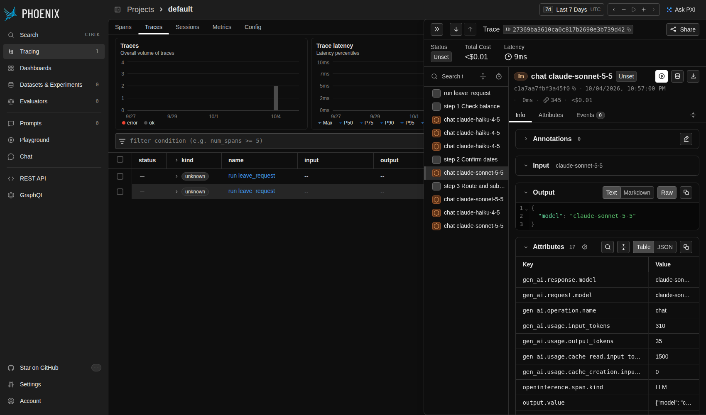

# Observability

Cograil sends OpenTelemetry (OTel) spans for every Run. A span is a timed record of one piece of
work. Spans show an operator how long a Run took, which model each call used, and what it cost.
They sit beside the audit trail and never replace it.

## What You Get

A Run execution is one trace, a tree of spans:

- `run <protocol>` is the top span. It covers one `run` or one `resume` of a Run.
- `step <n> <name>` is a child of the Run span, one for each Step.
- `chat <model>` is a child of the Step span, one for each model call a Step makes. A Step's turn,
  a compression and an injection screen each make one. The classification of a chat message, the
  small-tier redaction and eval runs make model calls outside a Step; they have no span yet.

A model call's tokens and cost belong to its own `chat` span: charging one anywhere else is
refused as an error instead of putting its usage on the Step or Run span.

## Attributes

Run and Step spans carry these attributes:

| Attribute | On | Meaning |
| --- | --- | --- |
| `cograil.run_id` | Run, Step | The Run's id |
| `cograil.workspace` | Run | The Workspace |
| `cograil.colleague` | Run | The Colleague |
| `cograil.protocol` | Run | The Protocol |
| `cograil.step.number` | Step | The Step's number |
| `cograil.step.name` | Step | The Step's name |

Model spans follow the OTel GenAI (generative AI) naming, so tools such as Arize Phoenix can read
them:

| Attribute | Meaning |
| --- | --- |
| `gen_ai.operation.name` | Always `chat` |
| `gen_ai.request.model` | The model Cograil asked for |
| `gen_ai.response.model` | The model that answered |
| `gen_ai.usage.input_tokens` | Fresh prompt tokens only |
| `gen_ai.usage.output_tokens` | Tokens the model wrote |
| `gen_ai.usage.cache_read.input_tokens` | Prompt tokens read from saved context |
| `gen_ai.usage.cache_creation.input_tokens` | Prompt tokens written to saved context |
| `cograil.cost_usd` | The call's cost in dollars |

`input_tokens` does not include the cache tokens. They are reported apart because they are billed
at different rates (see [ADR 0013](adr/0013-runtime-cost-discipline.md) and "Saved context" in
[Models, Tiers and Ollama](models.md)). `cograil.cost_usd` comes from the `pricing` entries in
`harness.yaml`. A model with no price entry costs 0.

## What Spans Never Hold

Spans never carry prompts, Tool arguments or Tool output. They hold ids, names, models, tokens and
cost. When a Run fails, the span that it failed in is marked as an error and names the type of the
error (for example `ProviderError`), never its message or stack trace, because a message can hold a
Tool's error text with personal data in it. The audit trail stays the record of what happened and
who did it.

## Where Spans Go

Cograil picks one exporter when it starts:

- By default, spans print to the console on stderr, one JSON line per span.
- If `OTEL_EXPORTER_OTLP_ENDPOINT` is set, spans go to that address over HTTP using OTLP (the
  OpenTelemetry protocol). Set the other standard `OTEL_*` variables, such as
  `OTEL_EXPORTER_OTLP_HEADERS`, as you normally would.

The CLI commands and the API app both set this up, through `configure_tracing` in
`observability.py`.

A pause for approval ends the first execution's trace. When someone runs `cograil approve`, the
resumed Run starts a new `run` trace.

## Try It With Arize Phoenix

Phoenix is an open-source viewer for traces. It runs on your machine.

1. Install and start it:

   ```bash
   pip install arize-phoenix
   phoenix serve
   ```

2. In another terminal, point Cograil at it and run a Protocol:

   ```bash
   OTEL_EXPORTER_OTLP_ENDPOINT=http://localhost:6006 uv run cograil run workspaces/example-smb --protocol leave_request --as alice@example.com --message "Annual leave from 2026-11-02 to 2026-11-04, please"
   ```

3. Open `http://localhost:6006` and look at the newest trace.



The screenshot shows the `leave_request` run of `workspaces/example-smb`: the Run, its Steps and a
standard-tier `chat` span with its tokens.
